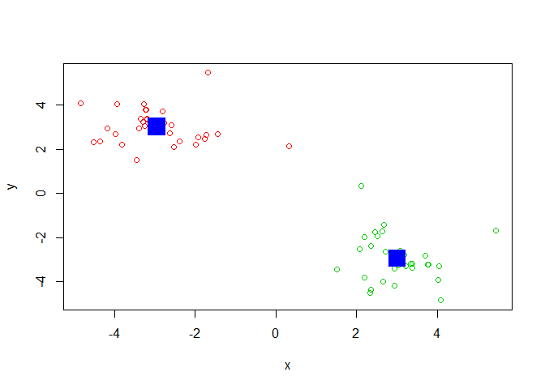

LECTURE09
================
Berenice R. Leal
2/4/2020

## K-means clustering

The main k-means function in R is called ’kmeans(), Lets play it here.

``` r
#Generate ome example data for clustering

#rnorm is to generate random data from normal distritution, 30 points, center at -3, next time 30 points centered at 3.... cbind is to combine objects by row or column.... rev reverses 

tmp <- c(rnorm(30,-3), rnorm(30,3))
x <- cbind(x=tmp, y=rev(tmp))
plot(x)
```

<!-- -->

Use the kmeans() function setting k to 2 and nstart=20 Inspect/print the
results Q. How many points are in each cluster? 60 points in 2 clusters:
30 points Q. What ‘component’ of your result object details - cluster
size? 2  
\- cluster assignment/membership? what is membership vector km$cluster -
cluster center? cluster 1 is centered at -2.956379 2.970779 and 2 at
2.970779 -2.956379 Plot x colored by the kmeans cluster assignment and
add cluster centers as blue points

  - available components? output for the functions

<!-- end list -->

``` r
#kmeans (x, centers =2, nstart=20 iterations)


# data is random... results may vary
km <- kmeans(x,2,20)
km
```

    ## K-means clustering with 2 clusters of sizes 30, 30
    ## 
    ## Cluster means:
    ##           x         y
    ## 1 -2.944198  3.006300
    ## 2  3.006300 -2.944198
    ## 
    ## Clustering vector:
    ##  [1] 1 1 1 1 1 1 1 1 1 1 1 1 1 1 1 1 1 1 1 1 1 1 1 1 1 1 1 1 1 1 2 2 2 2 2 2 2 2
    ## [39] 2 2 2 2 2 2 2 2 2 2 2 2 2 2 2 2 2 2 2 2 2 2
    ## 
    ## Within cluster sum of squares by cluster:
    ## [1] 52.58582 52.58582
    ##  (between_SS / total_SS =  91.0 %)
    ## 
    ## Available components:
    ## 
    ## [1] "cluster"      "centers"      "totss"        "withinss"     "tot.withinss"
    ## [6] "betweenss"    "size"         "iter"         "ifault"

``` r
km$cluster
```

    ##  [1] 1 1 1 1 1 1 1 1 1 1 1 1 1 1 1 1 1 1 1 1 1 1 1 1 1 1 1 1 1 1 2 2 2 2 2 2 2 2
    ## [39] 2 2 2 2 2 2 2 2 2 2 2 2 2 2 2 2 2 2 2 2 2 2

``` r
#how many components have what we want $$$

length(km$cluster)
```

    ## [1] 60

``` r
table(km$cluster)
```

    ## 
    ##  1  2 
    ## 30 30

``` r
#Plot x colored by the kmeans cluster assignment and

plot(x, col=km$cluster+1)

# add cluster centers as blue points... the +1 changes the colors.

points(km$centers, col="blue", pch=15, cex=3)
```

<!-- -->

## Hierarchical Clustering in R

The main Hierarchical clustering function in R is called hclust() An
important point here is that you have to calculate the distance matrix
deom your input data before calling ‘hclust’ For this we will use the
‘dist()’ function first

``` r
# We will use our x again from above...

d <- dist(x)
hc <- hclust(d)
hc
```

    ## 
    ## Call:
    ## hclust(d = d)
    ## 
    ## Cluster method   : complete 
    ## Distance         : euclidean 
    ## Number of objects: 60

Folks often view the results of Hierarchical clstering graphically. Lets
try passinf this to the ‘plot ()’ function.

``` r
plot(hc)

#    hclust(dist(x))
#the numbers are from the vector 1 - 60 ---- left 1 to 30, and right 31 to 60


abline(h=6, col="red", lty=2)     #to draw a line
abline(h=4, col="red", lty=2)  
```

<!-- -->

``` r
cutree(hc, h=6)
```

    ##  [1] 1 2 2 2 2 2 2 2 2 2 2 2 2 2 2 2 2 2 2 2 2 2 2 2 2 2 2 2 2 2 3 3 3 3 3 3 3 3
    ## [39] 3 3 3 3 3 3 3 3 3 3 3 3 3 3 3 3 3 3 3 3 3 1

``` r
# To get cluster membership vector I need to "cut" the tree at a certain height to yield my separate cluster branches.       

# cutree(hc, h=6,)
```

``` r
gp4 <- cutree(hc, k=6)
table(gp4)
```

    ## gp4
    ##  1  2  3  4  5  6 
    ##  2 21  8 20  8  1

MY TURN:

``` r
# Step 1. Generate some example data for clustering
x <- rbind(
 matrix(rnorm(100, mean=0, sd = 0.3), ncol = 2), # c1
 matrix(rnorm(100, mean = 1, sd = 0.3), ncol = 2), # c2
 matrix(c(rnorm(50, mean = 1, sd = 0.3), # c3
 rnorm(50, mean = 0, sd = 0.3)), ncol = 2))
colnames(x) <- c("x", "y")
# Step 2. Plot the data without clustering
plot(x)
```

<!-- -->

``` r
# Step 3. Generate colors for known clusters
# (just so we can compare to hclust results)
col <- as.factor( rep(c("c1","c2","c3"), each=50) )
plot(x, col=col)
```

<!-- -->

MY TURN:

Q. Use the dist(), hclust(), plot() and cutree() functions to return 2
and 3 clusters

``` r
#..........

hc <- hclust(dist(x))

plot(hc)

abline(h=1.7, col="red")
```

<!-- -->

To get cluster membership vector use ‘cutree()’ and then use ‘table()’
to tabulate up how many members in each cluster we have

``` r
grps <- cutree(hc, k=3)
table(grps)
```

    ## grps
    ##  1  2  3 
    ## 50 55 45

Make a plot with our cluster results… When THE Data is ambiguous it isnt
so effective… at the boundaries this method isnt great.

``` r
plot(x, col=grps)
```

<!-- -->

Q. How does this compare to your known ‘col’ groups?

HANDS ON SECTION:

``` r
x <- read.csv("UK_foods.csv", row.names=1)
x
```

    ##                     England Wales Scotland N.Ireland
    ## Cheese                  105   103      103        66
    ## Carcass_meat            245   227      242       267
    ## Other_meat              685   803      750       586
    ## Fish                    147   160      122        93
    ## Fats_and_oils           193   235      184       209
    ## Sugars                  156   175      147       139
    ## Fresh_potatoes          720   874      566      1033
    ## Fresh_Veg               253   265      171       143
    ## Other_Veg               488   570      418       355
    ## Processed_potatoes      198   203      220       187
    ## Processed_Veg           360   365      337       334
    ## Fresh_fruit            1102  1137      957       674
    ## Cereals                1472  1582     1462      1494
    ## Beverages                57    73       53        47
    ## Soft_drinks            1374  1256     1572      1506
    ## Alcoholic_drinks        375   475      458       135
    ## Confectionery            54    64       62        41

Lets make some plots to explore our data a bit more

``` r
barplot(as.matrix(x), beside=T, col=rainbow(nrow(x)))
```

<!-- -->

``` r
pairs(x, col=rainbow(10), pch=16)
```

<!-- -->

``` r
#matrix of scatterplots
```

Principal Component Analysis (PCA) with the ‘prcomp()’ function.

``` r
# Use the prcomp() PCA function .... t is transpose?
pca <- prcomp ( t(x) )

pca
```

    ## Standard deviations (1, .., p=4):
    ## [1] 3.241502e+02 2.127478e+02 7.387622e+01 4.188568e-14
    ## 
    ## Rotation (n x k) = (17 x 4):
    ##                              PC1          PC2         PC3          PC4
    ## Cheese              -0.056955380 -0.016012850 -0.02394295 -0.691718038
    ## Carcass_meat         0.047927628 -0.013915823 -0.06367111  0.635384915
    ## Other_meat          -0.258916658  0.015331138  0.55384854  0.198175921
    ## Fish                -0.084414983  0.050754947 -0.03906481 -0.015824630
    ## Fats_and_oils       -0.005193623  0.095388656  0.12522257  0.052347444
    ## Sugars              -0.037620983  0.043021699  0.03605745  0.014481347
    ## Fresh_potatoes       0.401402060  0.715017078  0.20668248 -0.151706089
    ## Fresh_Veg           -0.151849942  0.144900268 -0.21382237  0.056182433
    ## Other_Veg           -0.243593729  0.225450923  0.05332841 -0.080722623
    ## Processed_potatoes  -0.026886233 -0.042850761  0.07364902 -0.022618707
    ## Processed_Veg       -0.036488269  0.045451802 -0.05289191  0.009235001
    ## Fresh_fruit         -0.632640898  0.177740743 -0.40012865 -0.021899087
    ## Cereals             -0.047702858  0.212599678  0.35884921  0.084667257
    ## Beverages           -0.026187756  0.030560542  0.04135860 -0.011880823
    ## Soft_drinks          0.232244140 -0.555124311  0.16942648 -0.144367046
    ## Alcoholic_drinks    -0.463968168 -0.113536523  0.49858320 -0.115797605
    ## Confectionery       -0.029650201 -0.005949921  0.05232164 -0.003695024

What is in my result object ‘pca’? I can check the attributes…

``` r
attributes(pca)   #tells you what functions are available  --- 
```

    ## $names
    ## [1] "sdev"     "rotation" "center"   "scale"    "x"       
    ## 
    ## $class
    ## [1] "prcomp"

``` r
plot(pca$x[,1], pca$x[,2], xlab="PC1", ylab="PC2")
text(pca$x[,1], pca$x[,2], colnames=(x),
     col=c("black", "red", "blue", "green"))
```

    ## Warning in text.default(pca$x[, 1], pca$x[, 2], colnames = (x), col =
    ## c("black", : "colnames" is not a graphical parameter

<!-- -->

``` r
summary(pca)
```

    ## Importance of components:
    ##                             PC1      PC2      PC3       PC4
    ## Standard deviation     324.1502 212.7478 73.87622 4.189e-14
    ## Proportion of Variance   0.6744   0.2905  0.03503 0.000e+00
    ## Cumulative Proportion    0.6744   0.9650  1.00000 1.000e+00

``` r
#over 67% capture in PC1 proportion of variance
#0.9650 = 0.6744+0.2905
```
